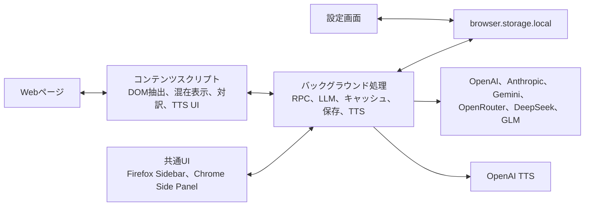

# アーキテクチャ

Mazelingo-FXは、WXTとTypeScriptで構成したManifest V3拡張です。
FirefoxとChromeで翻訳や表示の処理を共有し、manifestとパネルAPIだけをブラウザ境界で切り替えます。

## エントリーポイント

WXTは各エントリーポイントを検出し、対象ブラウザ向けのmanifest、バックグラウンド処理、コンテンツスクリプト、HTMLを生成します。
`public/`にあるアイコンとデータは生成物へコピーされます。

| 場所                                                   | 役割                                                                             |
| ------------------------------------------------------ | -------------------------------------------------------------------------------- |
| `entrypoints/background.ts`、`entrypoints/background/` | 起動、メッセージ処理、設定、キャッシュ、語彙、TTS、ツールバー操作                |
| `entrypoints/content/`                                 | DOM抽出、画面遷移の監視、翻訳適用、混在表示、対訳表示、クリック切り替え、TTS操作 |
| `entrypoints/sidepanel/`                               | Firefox SidebarとChrome Side Panelで共有する操作UI                               |
| `entrypoints/options/`                                 | モデル、APIキー、表示言語などの設定UI                                            |

## バックグラウンド処理

バックグラウンド処理は、`browser.runtime`メッセージの窓口です。
初回設定、RPC、LLMプロバイダーへの直接通信、OpenAI TTS、翻訳キャッシュ、文法解説、語彙、Norma処理を担当します。
コンテンツスクリプトへAPIキーを渡さず、外部APIとの通信をバックグラウンド処理へ集約します。

## コンテンツスクリプト

コンテンツスクリプトは、ページ内の末端ブロックを抽出し、HTML構造を保った翻訳単位をバックグラウンド処理へ送ります。
翻訳結果はDOM上へ重ねて表示します。
通常の画面遷移、再読み込み、`MutationObserver`による変化、SPAとHistory APIによる画面遷移を考慮しています。
ブラウザAPIに依存しない処理は、`utils/content-logic*`、`utils/dom-overlay*`、`utils/translation.ts`などへ分離します。

## SidebarとSide Panel

`entrypoints/sidepanel/`のHTMLと処理は、FirefoxとChromeで共有します。
FirefoxではSidebar、ChromeではSide Panelとして表示します。
ツールバーのアイコンから開く操作だけがブラウザ固有です。

## LLM処理

LLM処理は、モデルの判定、要求の生成、応答の解析、プロンプトを役割ごとに分けています。

- `utils/llm-registry.ts`：モデルの接頭辞、エンドポイント、形式、キーの対応
- `utils/llm-providers.ts`：プロバイダー別の要求生成と応答解析
- `utils/llm.ts`：プロバイダーの解決、通信、代替処理
- `utils/prompts.ts`：翻訳と解説のプロンプト
- `utils/schemas.ts`：メッセージ内容の実行時検証

## ローカル保存

ローカル保存には`browser.storage.local`を使います。
主なキーは`utils/keys.ts`で一元管理します。

| キー                      | 内容                                          |
| ------------------------- | --------------------------------------------- |
| `mlg_config`              | APIキー、モデル、言語、混在率、対象サイトなど |
| `mlg_translation_cache`   | 翻訳キャッシュ                                |
| `mlg_norma_cache`         | Norma処理のキャッシュ                         |
| `mlg_vocab`               | 語彙                                          |
| `mlg_pending_explanation` | パネルをまたいで引き継ぐ文法解説の状態        |
| `mlg_ui_language`         | UIの表示言語                                  |
| `mlg_my_examples`         | 保存した利用例                                |

APIキーは、`mlg_config.apiKeys`へ平文で保存します。
アプリによる暗号化や、独自のバックエンドへの同期は行いません。

## ブラウザ固有処理の境界

ブラウザによる差分は、`wxt.config.ts`と`utils/browser-actions.ts`へ集約します。
`wxt.config.ts`は、Firefoxの`sidebar_action`とChromeの`side_panel`を対象別に生成します。
`utils/browser-actions.ts`は、Firefoxの`sidebarAction`とChromeの`sidePanel`を呼び分けます。
共通処理へ条件分岐を散在させず、この二つの場所に差分を閉じ込めます。
対応関係は[Firefox移植](FIREFOX_PORT.md)を参照してください。
