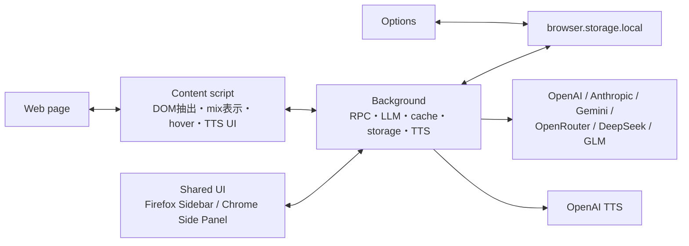

# アーキテクチャ

Mazelingo-FXはWXT + TypeScriptで構成したManifest V3拡張です。FirefoxとChromeで共通の翻訳・表示logicを使い、manifestとpanel APIだけをbrowser境界で切り替えます。

## Entrypoints

| 場所                                                   | 役割                                                                      |
| ------------------------------------------------------ | ------------------------------------------------------------------------- |
| `entrypoints/background.ts`、`entrypoints/background/` | 起動、message処理、設定・cache・語彙・TTS、toolbar action                 |
| `entrypoints/content/`                                 | DOM抽出、navigation監視、翻訳適用、mix表示、hover、click切り替え、TTS操作 |
| `entrypoints/sidepanel/`                               | Firefox SidebarとChrome Side Panelで共有する操作UI                        |
| `entrypoints/options/`                                 | model、API key、表示言語などの設定UI                                      |

WXTがentrypointを検出し、対象browser用manifest、background、content script、HTMLを生成します。`public/`のiconとdataは生成物へコピーされます。

## Background

backgroundは`browser.runtime` messageの窓口です。初回設定、RPC、LLM providerへの直接fetch、OpenAI TTS、翻訳cache、文法解説、語彙、Norma処理を担当します。content scriptへAPI keyを渡さず、外部API通信をbackgroundへ集約します。

## Content script

ページ内の末端blockを抽出し、HTML構造を保った翻訳単位をbackgroundへ送ります。結果をDOM overlayとして適用します。通常navigation、reload、MutationObserverによる変化、SPA / History API navigationを考慮します。browser APIに依存しない処理は`utils/content-logic*`、`utils/dom-overlay*`、`utils/translation.ts`などへ分離します。

## Sidebar / Side Panel

`entrypoints/sidepanel/`のHTMLとlogicは両browserで共用します。FirefoxではSidebar、ChromeではSide Panelとしてhostされます。toolbar iconから開く操作のみbrowser固有です。

## LLM layer

- `utils/llm-registry.ts`: model prefix、endpoint、format、keyの対応
- `utils/llm-providers.ts`: provider別request生成とresponse解析
- `utils/llm.ts`: provider解決、fetch、fallback
- `utils/prompts.ts`: 翻訳・解説prompt
- `utils/schemas.ts`: message payloadのruntime validation

## Storage

`browser.storage.local`を使います。主なkeyは`utils/keys.ts`で一元管理します。

| key                       | 内容                                        |
| ------------------------- | ------------------------------------------- |
| `mlg_config`              | API key、model、言語、mix比率、対象siteなど |
| `mlg_translation_cache`   | 翻訳cache                                   |
| `mlg_norma_cache`         | Norma処理cache                              |
| `mlg_vocab`               | 語彙                                        |
| `mlg_pending_explanation` | panelをまたぐ文法解説状態                   |
| `mlg_ui_language`         | UI言語                                      |
| `mlg_my_examples`         | 保存した利用例                              |

API keyは`mlg_config.apiKeys`に平文保存されます。暗号化や独自backendへの同期はしません。

## Browser-specific layer

browser差分は、`wxt.config.ts`のtarget別manifest（Firefoxの`sidebar_action`、Chromeの`side_panel`）と、`utils/browser-actions.ts`のpanel adapter（Firefoxの`sidebarAction`、Chromeの`sidePanel`）です。共通coreへ条件分岐を散在させず、この2か所に閉じ込めます。対応表は[FIREFOX_PORT.md](FIREFOX_PORT.md)を参照してください。
